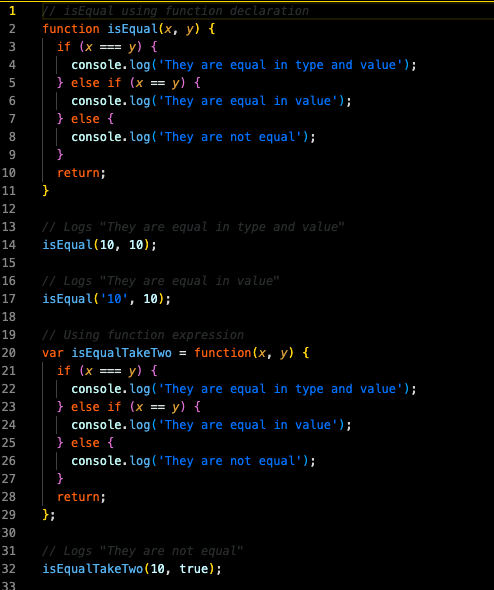

# 📖 Write Function to Evaluate Equality of Two Values

Work with a partner to implement the following user story:
* As a developer, I want to know when two values are equal to one another.

## Acceptance Criteria
* It is done when I provide two values in function arguments and the function evaluates the values' equality.
* It is done if, when the values are strictly equal, the message "They are equal in type and value" is logged.
* It is done if, when the two values are equal but not strictly equal, the message "They are equal in value" is logged.
* It is done if, when the values are not equal or strictly equal, the message "The values are not equal" is logged.

## 📝 Notes
Refer to the documentation:
[MDN Web Docs on functions](https://developer.mozilla.org/en-US/docs/Web/JavaScript/Guide/Functions)

## Mock Up
The following image demonstrates the unsolved function:

The following image demonstrates solved function:

## 💡 Hints
How can we use parameters to give a name to the two values that we want to evaluate with the function?

## 🏆 Bonus
If you have completed this activity, work through the following challenge with your partner to further your knowledge:
* What is hoisting?
In JavaScript, hoisting allows you to use functions and variables before they're declared.
